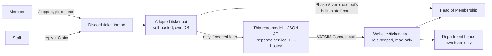

# Design note — Discord support tickets on the Membership Platform

> Status: **design / thinking only — not built.** This note explores bringing member
> `/support` conversations from Discord onto the website as trackable tickets, and
> preparing (not building) for KPIs. It deliberately reverses the original brief's
> "no ticket system" non-goal — see §1.

## TL;DR — the recommendation

**Start with almost nothing on this website.** The smallest step that delivers ~80% of
what you want ("see what's going on, who's handling what") is to stand up an **adopted,
self-hosted Discord ticket bot** with one route per team, a privacy notice on `/support`,
and its **built-in staff panel** — and run it for one full season (~3 months). No code in
this repo, no always-on custom service, no database to babysit.

Only if the bot's own panel proves insufficient after real use do you build the website
side (a read-only mirror + a small API + an authenticated `/tickets` area). Treat that as a
**separate go/no-go**, not an automatic next step. **Two-way replies from the website are
out of scope** — staff keep replying in Discord.

The one thing that must happen **before even the bot**: get the **GDPR data-controller
question answered in writing** (see §4 and §7). The moment the first ticket is stored, the
vACC is a data controller of members' private conversations. That is the real change here —
it is a *legal* change, not a technical one.

---

## 1. What changes, and why it's justified

The original brief said: *"No ticket/support system — tickets stay in the existing Discord
support system."* That assumed tickets staying invisible in Discord was acceptable. The HoM's
job across 8 departments is precisely to **see, coordinate, and translate** activity — and you
cannot manage what you cannot see. So the reversal is justified, but it is **bounded**:

- Discord stays where the work happens. The website becomes a **read-only mirror + management
  overlay**, never a replacement for the support conversation.
- The footprint is kept **minimal, purgeable, and legally defensible** by default.

## 2. How it would work end-to-end

1. A member runs `/support` and picks the concerned team.
2. The bot opens a ticket thread under that team's category; its first reply carries a short
   **privacy notice + link**.
3. Member and staff converse in-thread; a staffer clicks **Claim** — that *is* the assignment
   signal.
4. The bot records ticket state (opener, team, claimant, messages, timestamps) in **its own
   database, which the vACC controls**, and keeps a transcript.
5. **Phase A-zero stops here** — the HoM and department heads use the bot's built-in panel.
6. *Only if that proves insufficient:* a small read-model service projects the bot's data into
   a minimal store and exposes a plain JSON API; the website's auth-gated `/tickets` route reads
   it, with **department scoping enforced server-side**.

**Category → department mapping** is deterministic (mirrors `src/config/departments.ts`).
Rejected alternative: parsing pinged roles — fragile.

## 3. Data model (only if/when the website side is built)

Two layers: mutable projections the site reads, plus one **append-only event log** as the KPI
source of truth. **Note:** the critique (§8) argues this custom layer is premature — for the
first season, rely on the bot's own storage/transcripts and don't build any of the below until
a metric genuinely can't be pulled from the bot.

- **Team** — `id, name (1 of 8 depts), discord_category_id, discord_role_id, active`
- **StaffMember** — `id, cid, discord_id, display_name, role (dept_head|hom|staff), team_id`
  (reuses the Phase-2 VATSIM Connect CID list)
- **Ticket** — `id, discord_thread_id, member_cid?, member_discord_id, team_id, subject,
  status (open → awaiting_staff → awaiting_member → resolved → closed, +reopened),
  assignee_staff_id?, opened_at, first_response_at?, closed_at?, last_activity_at, deeplink`
- **Message** (isolated — heaviest PII) — `id, ticket_id, discord_message_id, author_role,
  author_ref, body? (nullable/purgeable), sent_at, edited_at, attachments_meta (counts only)`
- **Event** (append-only, immutable) — `event_id (dedupe key), ticket_id, type, at (UTC),
  department, actor_role, actor_ref (hash of CID, not raw), meta{assignee_ref?, resolution?}`
  Types: `ticket_opened · first_staff_response · assigned · status_changed · resolved · closed
  · reopened`

## 4. Access & privacy stance

| Role | Own tickets | Dept tickets | All | Write (assign/status) |
|---|---|---|---|---|
| Member | Read | — | — | request erasure |
| Department head | Read | Read + respond | — | own dept |
| HoM / admin | Read | Read | Read | all |

- **No logged-out/public ticket view, ever.** Every read maps to a VATSIM Connect CID;
  department scoping is a **server-side default-deny** filter.
- **Data minimization is the headline choice: link, don't mirror.** Store metadata + a
  deep-link into the Discord thread by default; treat capturing verbatim message bodies as an
  explicit, notified opt-in. This cuts the legal surface dramatically and keeps you largely out
  of minors'-data territory.
- **Legal basis:** legitimate interest + a one-page assessment; **consent** specifically for the
  CID↔Discord link. A notice at `/support` time is mandatory.
- **Retention:** purge any stored message bodies on close + N days (30–90); keep only the
  pseudonymous event log longer. **EU-region hosting.** One-click erase-by-CID from day one
  (VATSIM's standard is one month, no fee).

## 5. KPI-readiness — "prepare for, don't build"

Metrics are a **fold over event/transcript data**, not a feature to build now. The only data
that is *unrecoverable if not captured* is **timestamps** — and an adopted bot's transcripts
already preserve them. So the honest "prepare" move is small:

| KPI | Where it comes from | Do now? |
|---|---|---|
| Avg first-response time (Membership) | first staff message − ticket open, from transcripts | ensure the bot keeps timestamped transcripts |
| Requests resolved | count of closed/resolved tickets | free from the bot |
| Per-department participation | tickets grouped by team | free from the bot |
| **Needs published vs filled** | this platform's `needSchema` + new `filled_at` / `filled_by` | **worth doing now — see below** |
| Members who joined a project | `filled_by` on filled needs | rides the Phase-2 need-editing flow |
| Conflicts defused informally | manual note (`/resolve informal`) | defer — no backfill penalty |

The **one no-regret change to this repo today** is adding two optional fields
(`filled_at`, `filled_by`) to the Contribuer `needSchema`. It's tiny, static-friendly, has no
privacy footprint, and makes "needs published vs filled" and "members who joined a project"
computable later. Everything else waits.

## 6. Phased roadmap

| Phase | What ships | Value | Effort | Risk |
|---|---|---|---|---|
| **A-zero** | Adopt the ticket bot: 8 team routes, `/support` privacy notice, built-in staff panel. **Nothing in this repo.** | High — the core "see what's going on" | XS | Low–Med (new PII store → GDPR from day one) |
| **A — mirror** | *Only if A-zero's panel is insufficient:* read-only ticket list on the website behind auth | Medium | S–M | Low (read-only) |
| **B — status/assignment** | Surface open/in-progress/resolved + claimant per team on the site | High | S–M | Low |
| **C — two-way replies** | ~~Reply from the website~~ | — | — | **Cut — scope creep** |
| **D — KPI dashboard** | Aggregate view, private | Med | M | Low (cheap once A–B captured the fields) |

**Start at A-zero and stop there for a season.** A ticket bot's built-in panel may deliver most
of the value at a fraction of the cost; the website mirror is disposable and can always be
rebuilt from Discord, so no ticket is ever "lost."

## 7. Recommended stack (for the website side, if it's ever built)

Kept as a **separate repo/service** — different runtime, secrets, and legal model; it must
never enter the static site repo.

- **Bot:** a mature self-hosted ticket bot (e.g. `discord-tickets`, GPLv3) — panels, category
  routing, Claim-based assignment, transcripts, its own DB. Zero custom Discord protocol code.
- **API (only if needed):** small TypeScript service (Hono) over a single **SQLite** file,
  streamed-backup to object storage, versioned REST, validating the VATSIM Connect session.
  *Avoid free tiers that sleep after inactivity* — a support system goes quiet over holidays.
- **Host:** one small always-on box (~€4–5/mo). **Name the person who maintains it.**
- **This repo:** at most a code-split `/tickets` route + a typed API client in
  `src/lib/tickets/` — the public bundle is unchanged. The existing Discord link stays as the
  low-tech fallback.

**Merge posture:** the portable asset is the **framework-agnostic JSON API contract**, not the
React components. When the site later merges into vatsim.fr/Angular, Angular calls the same API —
mergeability *improves*.

## 8. What the skeptical review flagged (and I agree with)

The critique pushed the design leaner, and it's right for a volunteer org:

- **A-zero probably answers the whole question.** Build it, run it a season, and only spec the
  website mirror if department heads actually complain about the bot's panel.
- **The custom API + event log is the over-engineering.** For "a few tickets a day," lean on the
  bot's own DB/UI and delete the projection layer until a metric truly can't be pulled from it.
- **The immutable event log is premature.** Don't manufacture hashed-CID data "for KPIs later"
  before anyone has asked for a number; reconstruct from transcripts if a KPI is ever requested.
- **Legitimate-interest for storing private chats is optimistic** — members expect `/support` to
  stay in Discord. Lead with the notice + the link-not-mirror default, or an opt-in for bodies.
- **Message Content intent:** confirm whether the adopted bot even needs the *privileged* intent
  (reading its own thread messages often does not) rather than assuming a user-count threshold
  clears it.
- **Two-way replies:** cut them. Attribution, moderation, audit, and sync burden for "one pane
  of glass" isn't worth it for volunteers.
- **Failure story is simple and should be stated:** Discord + the bot are the source of truth,
  the mirror is disposable and rebuildable — no ticket is ever lost.

## 9. Decisions to make before anything is built

1. **Data controller, in writing:** is the French vACC (via the HoM) the controller, or does
   VATSIM France / the division need to sign off under VATSIM's central data policy? **This
   gates storing anything — including the bot alone.**
2. **ToS/consent clearance** with Digital Services: is capturing `/support` acceptable under
   VATSIM's data policy + Code of Conduct, and is the consented CID↔Discord link permitted?
3. **Storage stance:** adopt **link-not-mirror** as default? Set the retention window; confirm
   **EU-region** hosting.
4. **Who maintains it:** name a person (ideally two) who can run the bot unaided, including
   through Discord API/intent changes. If there's no second name, don't build the custom service.
5. **Adopt vs custom bot:** confirm a self-hosted ticket bot (replaces the current `/support`
   UX) over a custom observer bot. Keeping the exact current `/support` UX would force the
   higher-maintenance custom path — decide explicitly.
6. **One-way only:** commit to read-only (Phase A/B); hold two-way as a later go/no-go, if ever.
7. **Compliance artifacts before go-live:** privacy notice + bot privacy policy published;
   `/support` first-reply notice wired; erase-by-CID and retention purge working.
